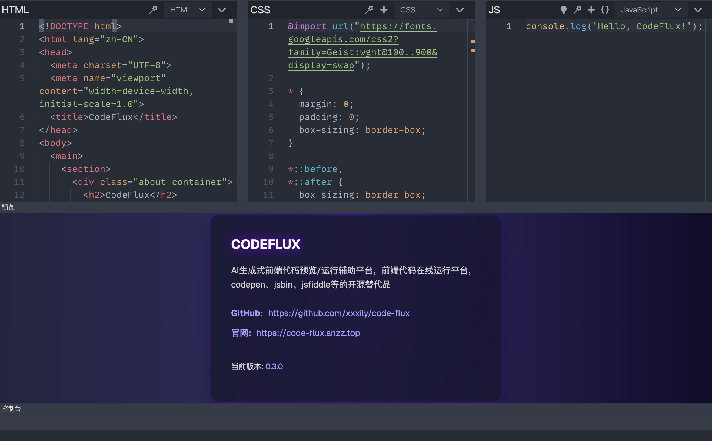
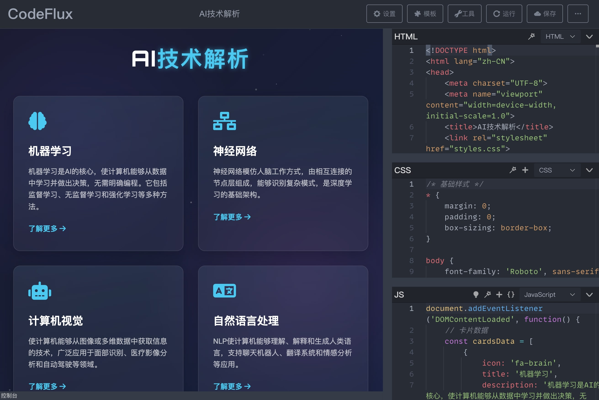
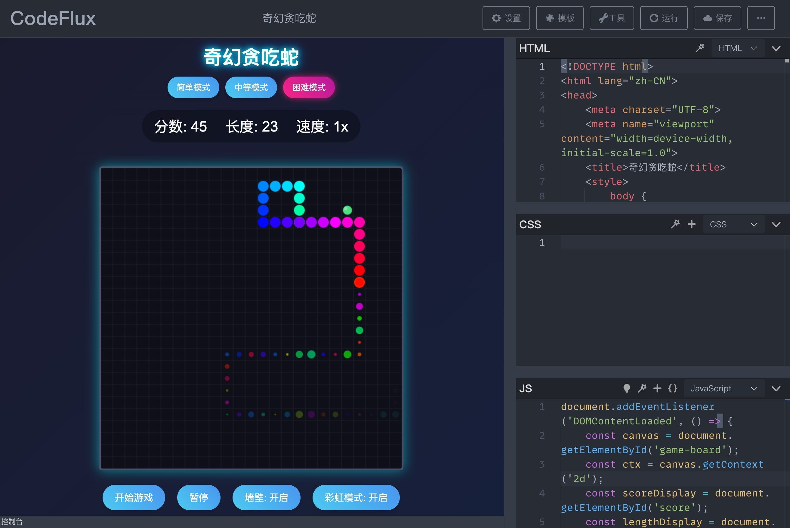
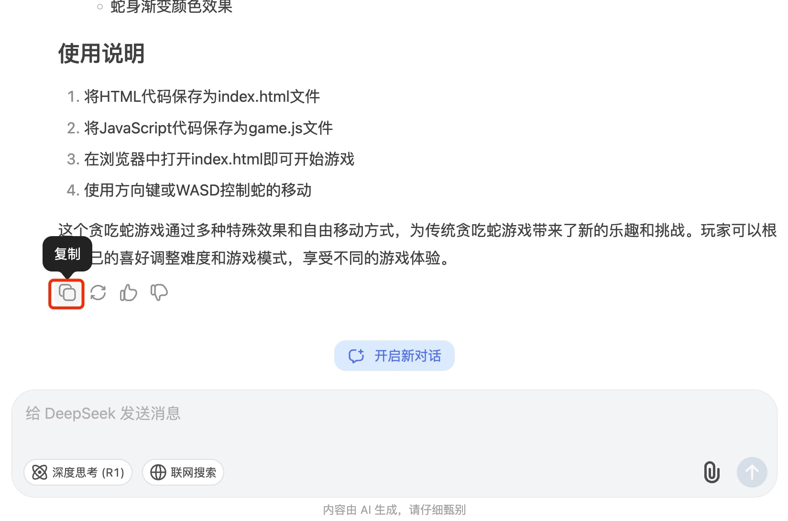
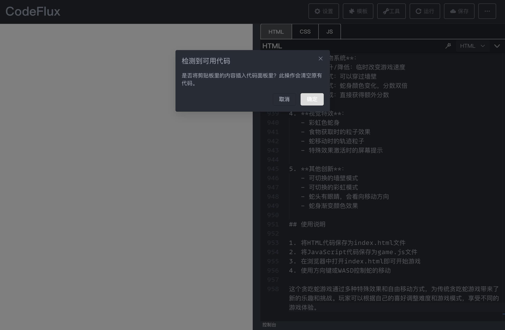
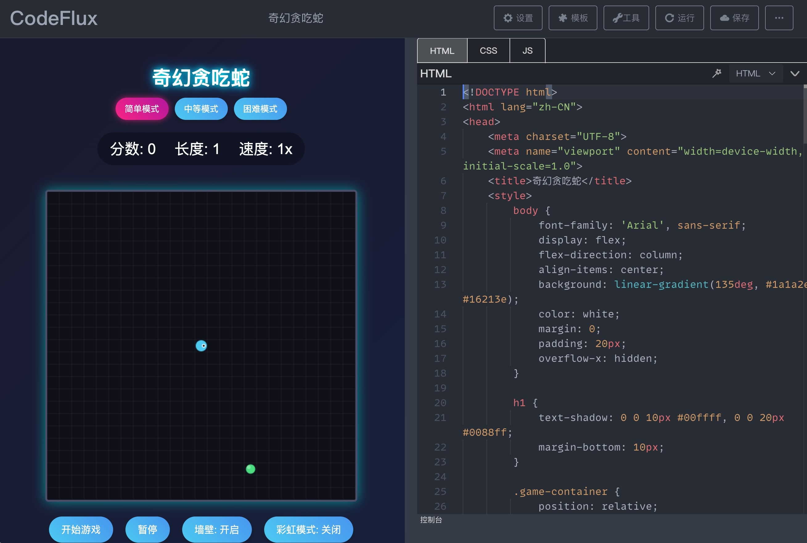

English  |  **[中文文档](./README-zh.md)**

# RunCode

> A versatile tool for previewing and fine-tuning AI-generated frontend code, an online platform for running and publishing frontend code, and an open-source alternative to codepen, jsbin, jsfiddle, etc.

Live demo: [runcode.liujiarong.top](https://runcode.liujiarong.top)  
GitHub: [git.liujiarong.top/project/run-code](https://git.liujiarong.top/project/run-code)  

# Use Cases

> The main goal of this project is to leverage AI-generated frontend code capabilities to easily preview or fine-tune AI-generated frontend pages, and quickly publish high-quality, interactive web creations adaptable to multiple scenarios.

#### 1️⃣ Instant Visualization of AI-Generated Web Content

- Quickly render AI-generated info cards, data dashboards, and other visual components/pages
- Real-time preview of personal homepages, stylized resumes, and other web creations
- Dynamically debug SVG vector graphics and Canvas animation parameters

#### 2️⃣ Agile Development of Interactive Elements

- WYSIWYG editing of AI-generated form components
- Instant validation of interaction logic in AI-generated web mini-games
- Visual adjustment of CSS animation keyframes and transition effects

#### 3️⃣ Rapid Validation of Product Prototypes

- Quickly build prototype pages based on AI-generated code
- Instantly experience desired product interaction effects
- Real-time debugging of cross-device responsive layouts

Discover more practical applications as you explore!

# Interface Screenshots







# Features

- [x] One-click execution of AI-generated frontend code

- [x] Mobile device compatibility

- [x] Support for various preprocessor languages

- [x] Flexible layout switching options

- [x] Support for adding external CSS and JS resources

- [x] Built-in collection of common templates

- [x] ZIP export functionality

- [x] Code formatting support

- [x] Elegant and powerful console

- [x] Support for Vue single-file components (2.x, 3.x)

- [x] Direct compatibility with VSCode themes, with numerous high-quality themes pre-installed

- [x] Built-in support for saving to GitHub Gist ([gist API](https://docs.github.com/en/rest/reference/gists)), with easy customization for your own storage system

- [x] Built-in support for saving changes to URL when GitHub Gist is not configured, making it easy to share with others

- [x] Built-in support for generating beautiful code images similar to [carbon](https://carbon.now.sh/)

- [x] Built-in support for using ES modules in the browser via [unpkg](https://unpkg.com/) and [importmap](https://github.com/WICG/import-maps)

- [x] Embed mode support for easy integration with documentation sites, making document examples more accessible

# Live Examples

#### AI-Generated Product Landing Pages

| Name | Prompt | Model | Link | Completeness | Notes |
|------|--------|-------|------|--------------|-------|
| [RunCode Introduction Page](https://runcode.liujiarong.top/#/share/5e4c89d6dd6cb58891d4e23ca85257e6) | - | DeepSeek-V3-0324 | [Link](https://runcode.liujiarong.top/#/share/5e4c89d6dd6cb58891d4e23ca85257e6) | ★★★★☆ | - |

#### AI-Generated Simple Applications

| Name | Prompt | Model | Link | Completeness | Notes |
|------|--------|-------|------|--------------|-------|
| [Epic Resume Generator](https://runcode.liujiarong.top/#/share/6b868dd75420f96a64939356c932cee5) | - | DeepSeek-V3-0324 | [Link](https://runcode.liujiarong.top/#/share/6b868dd75420f96a64939356c932cee5) | ★★★★★ | - |
| [Galton Board Simulator](https://runcode.liujiarong.top/#/share/0318660a5d1a906cbea97780203d6469) | [content](https://awesome-ai-hub.anzz.top/web/game/3DGaltonBoardSimulator/gemini_pro_2.5/README.md) | gemini-2.5-pro-exp-03-25 | [Link](https://runcode.liujiarong.top/#/share/0318660a5d1a906cbea97780203d6469) | ★★★★☆ | - |

#### AI-Created Mini Games

| Name | Prompt | Model | Link | Completeness | Notes |
|------|--------|-------|------|--------------|-------|
| [Fantasy Snake Game](https://runcode.liujiarong.top/#/share/08ddfdffc6a8a1cc9491d5423418673d) | [content](https://awesome-ai-hub.anzz.top/web/game/snake_2025.03.28/README.md) | DeepSeek-V3-0324 | [Link](https://runcode.liujiarong.top/#/share/08ddfdffc6a8a1cc9491d5423418673d) | ★★★★★ | - |
| [Gravity Flip Parkour](https://runcode.liujiarong.top/#/share/08ddfdffc6a8a1cc9491d5423418673d) | [content](https://awesome-ai-hub.anzz.top/web/game/GravityFlipParkour_2025.03.28/README.md) | DeepSeek-V3-0324 | [Link](https://runcode.liujiarong.top/#/share/08ddfdffc6a8a1cc9491d5423418673d) | ★★☆☆☆ | - |

# Running/Previewing AI-Generated Frontend Code

On any AI platform that supports frontend code generation, use prompts to have the AI create your desired web page, then copy the generated content with a single click to the [RunCode](https://runcode.liujiarong.top) platform for execution/preview.

- Note: There's no need to separately copy HTML, CSS, or JS code. Simply copy the AI-generated content and paste it into the [RunCode](https://runcode.liujiarong.top) platform. RunCode will automatically recognize and break it down into the corresponding frontend code components.

Using content generated on the DeepSeek website as an example:

One-click copy:


Paste the copied content directly into the [RunCode](https://runcode.liujiarong.top) platform:


Click OK to automatically parse the code and run/preview it:


Note: We're considering developing a browser extension to allow direct execution on AI platforms in the future.

# Docker Deployment

This project provides Docker deployment support with two deployment methods:

## 1. Using docker-compose (Recommended)

```bash
# Clone the project
git clone https://git.liujiarong.top/project/run-code.git
cd run-code

# Start the service (run in background)
docker-compose up -d

# Stop the service
docker-compose down
```

After starting the service, you can access it at `http://localhost:56780`.

## 2. Manual Build and Run

```bash
# Clone the project
git clone https://git.liujiarong.top/project/run-code.git
cd run-code

# Build the image
npm run docker:build
# Or
docker build -t run-code .

# Run the container
npm run docker:run
# Or
docker run -p 8080:80 run-code
```

## Technical Details

- Base images: node:18-alpine (build stage), nginx:stable-alpine (production environment)
- Build artifacts located in the `/usr/share/nginx/html` directory
- Container exposes port 80
- Uses nginx as a static resource server

## Related Commands

The project provides the following Docker-related npm scripts:

- `npm run docker:build`: Build Docker image
- `npm run docker:run`: Run Docker container
- `npm run docker:up`: Start service using docker-compose
- `npm run docker:down`: Stop service using docker-compose

# Local Build

```bash
git clone https://git.liujiarong.top/project/run-code.git

cd run-code

npm i

npm run serve
```

# Building for Production

## Modifying the Application Base Path

First, confirm the base path for your application after building. The project's default base path is `./`. If you want to change it, follow these steps:

1. Modify the `publicPath` field in the `vue.config.js` file.

2. Modify the `base` field in the `src/config/index.js` file.

## Changing the Router Mode

The default router mode is `hash mode`. If you need to use `history` mode, modify the `routerMode` field in the `src/config/index.js` file.

Additionally, in history mode with multi-level paths, you may need to modify the following file:

1. Update the paths of `prettier`-related `js` resources in the `/public/index.html` file.

## Build Command

```bash
npm run build
```

# Project Technology Stack

Scaffolding: `Vue CLI`

Framework: `Vue 3.X` ecosystem, using Composition API via `script setup`

UI Library: `element-plus`

Code Editor: `Monaco Editor`

# About Using ESM

Currently, ESM is supported in `JavaScript`, `TypeScript`, `CoffeeScript`, `Vue3`, `Vue2`, and other modes. By default, if you import a module like this:

```js
import moment from 'moment'
```

It will be transformed to:

```js
import moment from 'https://unpkg.com/moment?module'
```

This uses [unpkg](https://unpkg.com/), but some modules don't have ESM versions available on unpkg, or the version obtained this way isn't what we expect. For example, when importing `vue`, we need `https://unpkg.com/vue@3.2.37/dist/vue.esm-browser.js`, but `https://unpkg.com/vue?module` defaults to `https://unpkg.com/vue@3.2.37/dist/vue.runtime.esm-bundler.js?module`, which can't run in the browser. In such cases, you can manually add an [importmap](https://github.com/WICG/import-maps) to set the source for imported modules.

# Adding New Themes

This tutorial is for migrating VSCode themes.

1. Determine the theme you want to add, install and switch to it in your local VSCode, then press `F1` or `Command/Control + Shift + P` or right-click to open the `Command Palette`. Find and click `Developer: Generate Color Theme From Current Setting`. VSCode will generate a JSON file, which you should save to the project's `/scripts/vscodeThemes/` directory.

2. Run the command `npm run convertTheme` in the terminal. The converted theme will be output to the project's `/public/themes` directory. Then run the command `npm run createThemeList` to generate the theme configuration. You can now see all themes in `Settings -> Theme Settings` and switch between them.

# Related Command Descriptions

- `npm run buildConsole`: Compiles the project's `/public/console/index.js` file to ES5 syntax, outputting to `compile.js` in the same directory. This file is loaded in the preview iframe; do not modify `compile.js` directly.

- `npm run buildMonacoWorker`: Packages the Monaco Editor's worker files. If the Monaco Editor version changes, you'll need to repackage these.

- `npm run convertTheme`: Converts VSCode theme files to Monaco Editor theme files.

- `npm run createThemeList`: Automatically generates a configuration file based on the theme file list.

- `npm run buildVueSFCCompiler`: Packages the `@vue/compiler-sfc` file for Vue3.

# Compiler Update Guide

Since this is a pure frontend project, preprocessor languages like `less`, `sass`, `typescript`, etc., need to be compiled online. This work is handled by each language's compiler, which you can find in the `/public/parses/` directory. Over time, these will fall behind their newer versions, so you'll need to update them periodically. Obtaining browser-compatible versions isn't easy, so here are some tips:

- `less`

First, run `npm i less`, then find the `less/dist/` directory in `node_modules`. Both files in this directory are in UMD format and can be used directly.

- `sass`

Currently using [sass.js](https://github.com/medialize/sass.js), but this project hasn't been updated in three years.

- `babel`

Babel provides a browser version; see the official documentation [@babel/standalone](https://babeljs.io/docs/en/babel-standalone).

- `typescript`

Run `npm i typescript` and find the `node_modules/typescript/lib/typescript.js` file, which also supports direct browser use.

- `coffeescript`

Run `npm i coffeescript` and find the `node_modules/coffeescript/coffeescript-browser-compiler-legacy/coffeescript.js` file, which supports direct browser use.

- `livescript`

Browser versions can be downloaded directly from its official repository [browser](https://github.com/gkz/LiveScript/blob/master/browser/), though it hasn't been updated in two years.

- `postcss`

Use `Browserify` or `webpack` to bundle it into a single file.

- Others

No browser version or successful compilation has been found for `stylus` yet. If you know how, please open an issue.

# Adding Code Templates

The project includes several common code templates that can be added or removed as needed. The template configuration file is in `src/config/templates.js`.

# Adding Page Layout Templates

## Tutorial

The project includes several common page layout templates. If these don't meet your needs, you can add new layouts. A layout is a Vue single-file component found in the `src/pages/edit/layouts/` directory. Each layout determines how to display the `editor`, `console`, and `preview` sections. The `editor` includes `js`, `css`, `html`, and `vue` editors, and you can configure which ones to show, their order, whether they can be dragged, etc. New layouts should be added to this directory.

Let's look at an example of adding a Vue single-file layout. First, determine the layout details: we want a `vue` editor on the left, with `preview` and `console` on the right. The `preview` module should be expanded by default, and the `console` minimized:

1. First, create a `VueSFC.vue` file in the `layouts` directory.

2. Modify the `src/config/constants.js` file to import this component and add the new layout to the `layoutList` and `layoutMap` configurations:

```js
import VueSFC from '../pages/edit/layouts/VueSFC.vue'

export const layoutList = [
	// ...
	{
		name: 'Vue Single File',
		value: 'vue',
	}
]

export const layoutMap = {
	// ...
	vue: VueSFC
}
```

You can add a preview image of this layout in the `src/assets/layoutImgs/` directory, import it in the `constants.js` file, and add it to the `previewImgMap` configuration.

After these changes, you'll see the new "Vue Single File" option in the layout settings dropdown in the page settings. Now, let's complete the content of `VueSFC.vue`.

3. You can reference the structure of other layouts, copy and modify them. The final content should look like this:

```vue
<template>
  <!-- This container has 2 direct DragItems arranged horizontally. The first DragItem can be shrunk to 0, the second DragItem can be shrunk to a minimum of 20px -->
  <Drag :number="2" dir="h" :config="[{ min: 0 }, { min: 20 }]">
    <!-- Editor block, index 0, scaling disabled, touch bar hidden -->
    <DragItem :index="0" :disabled="true" :showTouchBar="false">
      <!-- Editor added, internal editors arranged vertically, configured with editors to display -->
      <Editor dir="v" :showList="showList"></Editor>
    </DragItem>
    <!-- Preview & Console, index 1, can be dragged to scale -->
    <DragItem :index="1" :disabled="false">
      <!-- DragItem nests another container component. This container has 2 direct DragItems arranged vertically. The first DragItem can be shrunk to 0, the second DragItem has a default height of 48px and can be shrunk to a minimum of 48px -->
      <Drag :number="2" dir="v" :config="[{ min: 0 }, { min: 48, default: 48 }]">
        <DragItem
          :index="0"
          :disabled="true"
          :showTouchBar="false"
          title="Preview"
        >
          <Preview></Preview>
        </DragItem>
        <DragItem :index="1" :disabled="false" title="Console">
          <Console></Console>
        </DragItem>
      </Drag>
    </DragItem>
  </Drag>
</template>

<script setup>
import Editor from '@/components/Editor.vue'
import Preview from '@/components/Preview.vue'
import Console from '@/components/Console.vue'
import Drag from '@/components/Drag.vue'
import DragItem from '@/components/DragItem.vue'
import { reactive } from 'vue'

// Configure to show only the vue editor
const showList = reactive([
    {
        title: 'VUE',// Editor name
        disableDrag: true,// Disable dragging for scaling
        showTouchBar: false// Hide the touch bar
    }
])
</script>
```

The comments explain the details. Please refer to the component documentation below for more information.

## Layout-Related Component Documentation

### Drag Component

This component acts as a container, instantiating a `Resize` size drag adjustment class. It needs to contain `DragItem` components.

Component props:

|   Name   |   Description   |   Type   |   Default   |
| ---- | ---- | ---- | ---- |
|   dir   |   Arrangement of `DragItem` components inside the container. Options: h (horizontal), v (vertical)   |   String   |   h   |
|   number   |   Number of `DragItem` components inside   |   Number   |   0   |
|   config   |   Configuration for internal `DragItem` components. Array type, each item is an object with properties described in Table 1   |   Array   |   []   |

#### Table 1

Properties of each object in the `config` array:

|   Name   |   Description   |   Type   |   Default   |
| ---- | ---- | ---- | ---- |
|   default   |   Default displayed size of the corresponding indexed `DragItem` component. Width when `dir` is `h`, height when `dir` is `v`   |   Number   |   All `DragItem` components in the container share space equally   |
|   min   |   Minimum displayed size allowed for the corresponding indexed `DragItem` component. When dragging occurs and this component's space is compressed, it defaults to being compressed to 0 (completely hidden). If this property is configured, it won't shrink beyond the configured size   |   Number   |   0   |
|   max   |   Maximum displayed size allowed for the corresponding indexed `DragItem` component. When dragging occurs and this component's space is increased, it defaults to increasing to the maximum allowed size. If this property is configured, it won't expand beyond the configured size   |   Number   |   0   |

### DragItem Component

This component represents a draggable block that must be placed under a `Drag` component. It uses `slot` to pass in the content to be displayed. A `DragItem` component can nest another `Drag` container.

Component props:

|   Name   |   Description   |   Type   |   Default   |
| ---- | ---- | ---- | ---- |
|   disabled   |   Whether dragging is disabled   |   Boolean   |   false   |
|   touchBarSize   |   Size of the drag bar. Width when `dir` is `h`, height when `dir` is `v`   |   Number   |   20   |
|   index   |   Index of this component in the container's sibling `DragItem` component list, starting from 0   |   Number   |   0   |
|   showTouchBar   |   Whether to show the drag bar   |   Boolean   |   true   |
|   title   |   Title   |   String   |      |
|   hide   |   Whether to hide this component   |   Boolean   |   false   |

### Editor Component

This component currently includes `js`, `css`, `html`, and `vue` editors. You can control which ones to display and how they're arranged.

Component props:

|   Name   |   Description   |   Type   |   Default   |
| ---- | ---- | ---- | ---- |
|   hide   |   Whether to hide the editor   |   Boolean   |   false   |
|   dir   |   Layout direction, v (vertical), h (horizontal)   |   String   |   h   |
|   showList   |   List of editors to display. Array type, each item can be a number or an object (see Table 2)   |   Array   |   ['HTML', 'CSS', 'JS']   |

#### Table 2

Each item in the `showList` array can be a string with possible values: `HTML`, `CSS`, `JS`, `VUE`, representing the four types of editors. Configure which ones to display.

If you need to configure additional properties, such as whether to allow dragging of that editor, the configurable properties are as follows:

|   Name   |   Description   |   Type   |   Default   |
| ---- | ---- | ---- | ---- |
|   title   |   Editor name. Options: `HTML`, `CSS`, `JS`, `VUE`   |   String   |      |
|   disableDrag   |   Whether to disable dragging to scale this editor   |   Boolean   |      |
|   showTouchBar   |   Whether to show this editor's touch bar   |   Boolean   |      |

# Unresolved Issues

1. The code image generation feature occasionally produces images with heights exceeding the actual code height. The root cause and definitive solution have not yet been found. One potential approach is to provide an image cropping feature after generation.

2. In rare cases, themes may not apply correctly.

# Acknowledgements

This project is based on: [code-run](https://github.com/wanglin2/code-run)

# License

[MIT](https://opensource.org/licenses/MIT)